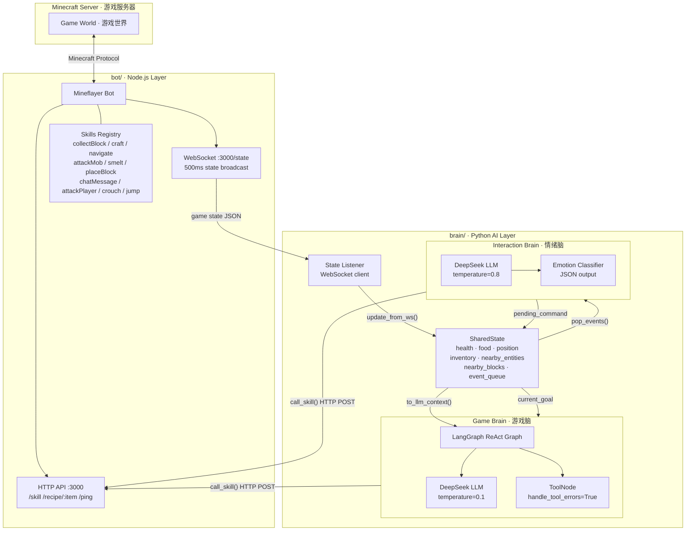
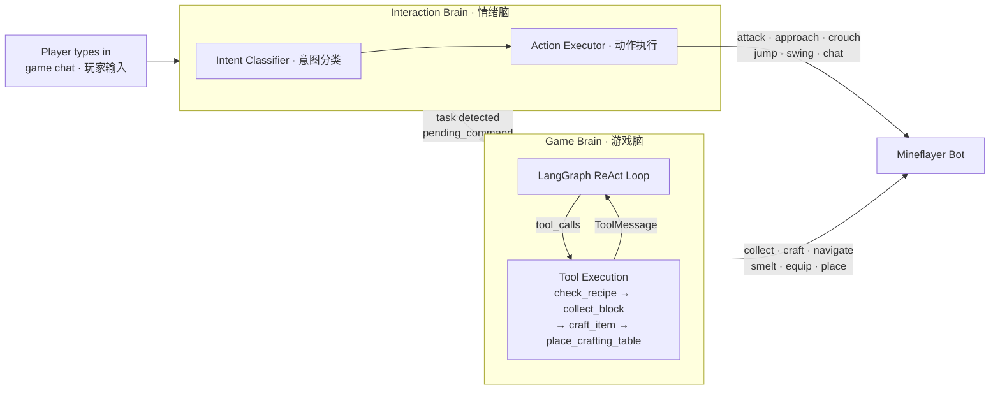
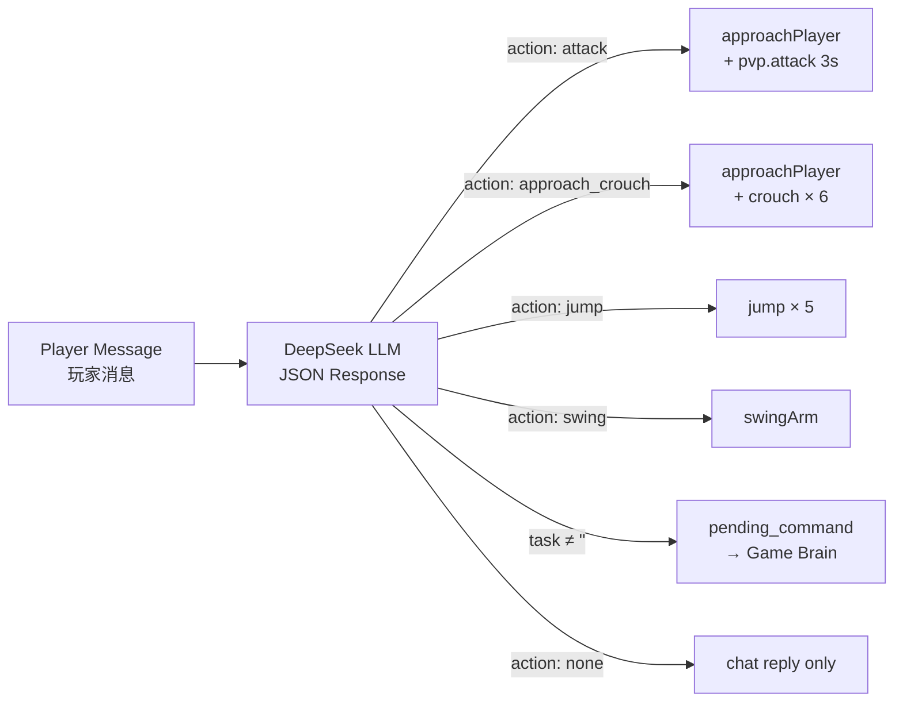
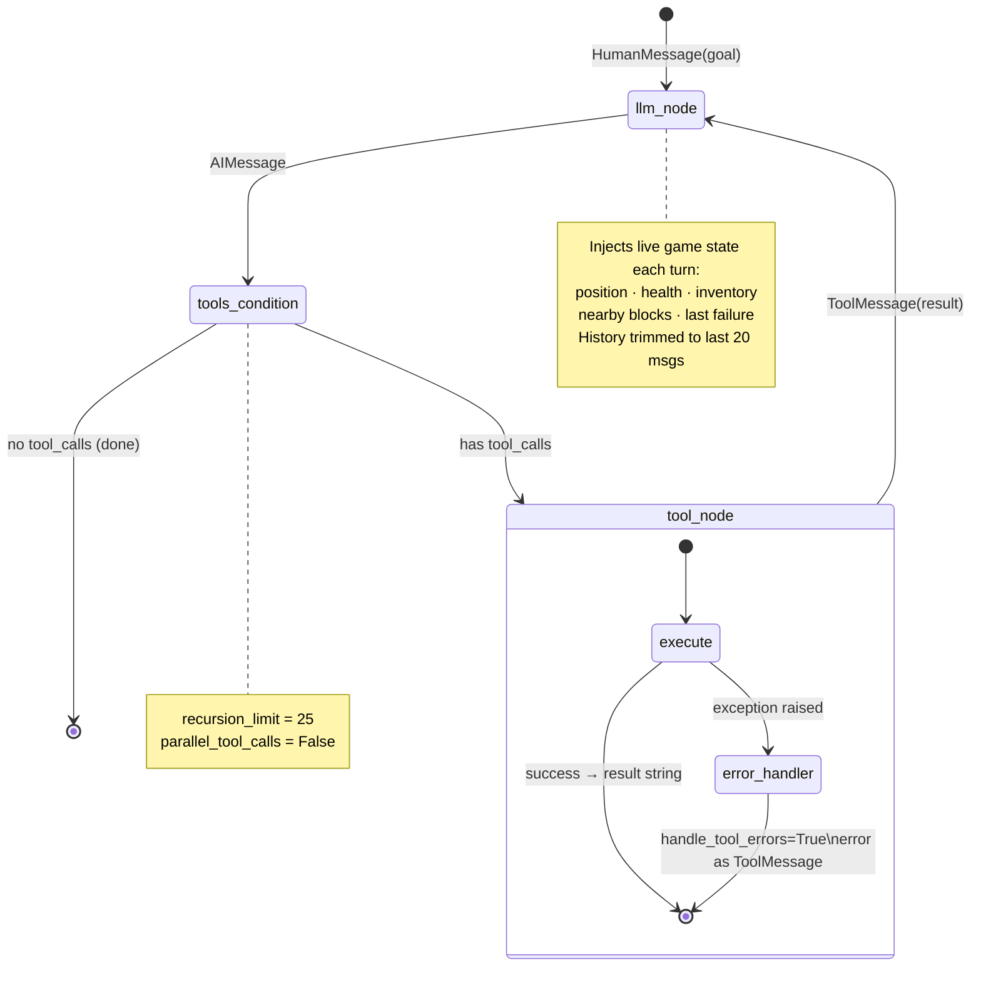
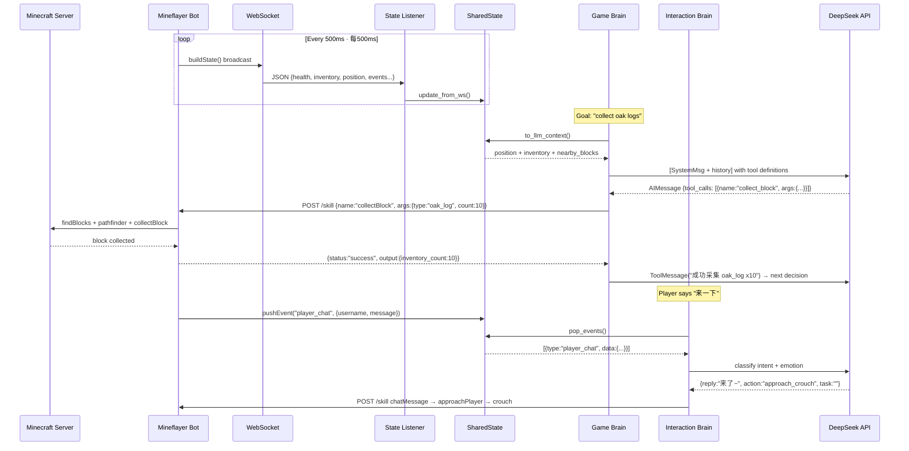

# Minecraft AI Companion · 我的世界 AI 游戏搭子

> An autonomous Minecraft AI agent driven by dual LLM brains — one for task execution, one for emotional interaction — controlled entirely through in-game chat.
>
> 由双 LLM 大脑驱动的自主 Minecraft AI 智能体，一个负责任务执行，一个负责情感互动，通过游戏内聊天框直接控制。

---

## Architecture Overview · 架构总览



---

## Dual-Brain Design · 双脑设计



### Emotion → Action Mapping · 情绪动作映射



---

## Game Brain · ReAct Loop Detail



---

## Data Flow · 数据流



---

## Project Structure · 项目结构

```
minecraft-livestream/
│
├── bot/                          # Node.js · Mineflayer layer
│   ├── bot_server.js             # HTTP + WebSocket server
│   │                             # POST /skill · GET /recipe/:item · GET /ping
│   │                             # WS /state  (500ms broadcast)
│   └── skills/
│       └── index.js              # All skill implementations (13 game + 6 interaction)
│
└── brain/                        # Python · AI decision layer
    ├── main.py                   # Entry point · asyncio.gather(3 coroutines)
    ├── shared_state.py           # Thread-safe game state singleton
    ├── bot_client.py             # HTTP call_skill() · WebSocket state_listener()
    ├── game_graph.py             # LangGraph ReAct graph · Game Brain
    ├── skills.py                 # LangChain @tool definitions (13 tools)
    ├── interaction_brain.py      # Emotion Brain · player chat handler
    └── requirements.txt
```

---

## Tech Stack · 技术栈

| Layer | Technology | Role |
|-------|-----------|------|
| Game Engine | Minecraft Java Edition 1.20.x | Game server |
| Bot Runtime | [Mineflayer](https://github.com/PrismarineJS/mineflayer) v4 | Bot SDK, game protocol |
| Pathfinding | mineflayer-pathfinder | A* navigation |
| Block Collection | mineflayer-collectblock | Auto gather + pickup |
| Combat | mineflayer-pvp | PVP/PVE combat |
| Bot API | Express + ws | REST + WebSocket bridge |
| AI Framework | [LangGraph](https://github.com/langchain-ai/langgraph) | ReAct agent graph |
| LLM | [DeepSeek-V3](https://platform.deepseek.com) | `deepseek-chat` via OpenAI-compatible API |
| LLM Client | langchain-openai | ChatOpenAI with custom base_url |
| State Bus | WebSocket (asyncio ↔ ws) | Real-time game state sync |

---

## Quick Start · 快速开始

### Prerequisites · 环境要求

| Requirement | Version |
|------------|---------|
| Node.js | ≥ 18 (v22 recommended) |
| Python | ≥ 3.10 |
| Minecraft Java Edition | 1.20.x |
| DeepSeek API Key | [platform.deepseek.com](https://platform.deepseek.com) |

> The Minecraft server must run in **offline mode** (`online-mode=false` in `server.properties`).
>
> Minecraft 服务器需开启离线模式（`server.properties` 中设置 `online-mode=false`）。

---

### Installation · 安装

**1. Clone & install Node.js dependencies · 安装 Node.js 依赖**

```bash
cd minecraft-livestream/bot
npm install
```

**2. Install Python dependencies · 安装 Python 依赖**

```bash
cd minecraft-livestream/brain
python3 -m venv .venv
source .venv/bin/activate        # Windows: .venv\Scripts\activate
pip install -r requirements.txt
```

**macOS SSL fix (first run only) · macOS 首次运行 SSL 修复**

```bash
/Applications/Python\ 3.*/Install\ Certificates.command
```

---

### Configuration · 配置

**Server address · 服务器地址** — `bot/bot_server.js` top section:

```javascript
const MC_HOST = '127.0.0.1'   // Your server IP · 服务器 IP
const MC_PORT = 25565          // Your server port · 服务器端口
const BOT_USERNAME = 'AIBot'   // Bot display name · 机器人名称
```

**API Key · DeepSeek 密钥** — replace in both files:

```
brain/game_graph.py        line 24   api_key="sk-..."
brain/interaction_brain.py line 23   api_key="sk-..."
```

**Default goal · 默认目标** — `brain/shared_state.py` line 23:

```python
current_goal: str = "survive and build a shelter"
```

---

### Launch · 启动

Open **two terminals** · 打开**两个终端**：

**Terminal A — Bot Server**
```bash
cd minecraft-livestream/bot
npm start
```
Expected output · 预期输出：
```
[HTTP] 监听端口 3000
[Bot] 已生成于 (x, y, z)
```

**Terminal B — AI Brain**
```bash
cd minecraft-livestream/brain
source .venv/bin/activate
python main.py
```
Expected output · 预期输出：
```
[Main] Bot Server 已就绪
[WS] 已连接到 Bot Server
[GameBrain] 开始执行目标: survive and build a shelter
[LLM→] 调用 check_recipe({'item': 'crafting_table'})
```

---

## In-Game Interaction · 游戏内交互

### Giving Tasks · 下达任务

Type in the Minecraft chat box. The Interaction Brain classifies the intent and routes task commands to the Game Brain automatically.

在 Minecraft 聊天框输入指令。情绪脑自动识别意图，任务类指令转交游戏脑执行。

```
去采集20个橡木原木
帮我合成一把铁镐
找铁矿石挖10个
打一只僵尸
```

The bot will reply `"收到！"` in chat and begin executing immediately.

---

### Emotional Interaction · 情感互动

| What you say · 你说的 | Bot reaction · 机器人反应 |
|----------------------|--------------------------|
| 笨蛋 / 废物 / 你真没用 | 傲娇回怼 → 冲过来攻击你 3 秒 |
| 你真棒 / 宝贝 / 好厉害 | 害羞回应 → 跑到你面前反复蹲起示好 |
| 来一下 / 过来 / 跟我来 | 回复"来了" → 靠近你蹲蹲打招呼 |
| 我发现钻石了！ | 兴奋回应 → 原地跳跳 |
| 你好 / 嗨 | 挥手 + 聊天回复 |
| 随便聊天 | 文字回复，不做额外动作 |

---

## Key Design Decisions · 关键设计决策

### Why LangGraph ReAct? · 为什么用 LangGraph ReAct？

Minecraft tasks are inherently **multi-step and conditional**: crafting a pickaxe requires knowing the recipe, collecting the right materials, placing a crafting table, then crafting. A single LLM call cannot handle this. LangGraph's ReAct loop lets the LLM observe tool results and adapt its plan dynamically — if `collect_block` fails with `no_oak_log_nearby`, the LLM autonomously switches to `birch_log` or triggers exploration.

我的世界任务本质上是**多步骤、有条件**的：合成一把镐需要查配方、采集材料、放合成台、再合成。单次 LLM 调用无法处理这种流程。LangGraph ReAct 循环让 LLM 能观察每步工具结果，动态调整计划——如果采集失败报 `no_oak_log_nearby`，LLM 会自主切换到 `birch_log` 或触发探索。

### Why `parallel_tool_calls=False`? · 为什么禁用并行工具调用？

Game state is mutable and sequential. Executing `craft_item` while `collect_block` is still running would read stale inventory state. Disabling parallel calls ensures the LLM sees the updated state after each action before deciding the next.

游戏状态是可变且串行的。在 `collect_block` 还在执行时就调 `craft_item` 会读到过期的背包状态。禁用并行调用确保 LLM 每次都能看到最新状态再决策。

### Why two separate LLMs? · 为什么两个独立 LLM？

The Game Brain uses `temperature=0.1` for deterministic, goal-directed behavior. The Interaction Brain uses `temperature=0.8` for natural, varied personality responses. Mixing them into one agent would force a compromise on both.

游戏脑用 `temperature=0.1` 保证行为确定、目标导向。情绪脑用 `temperature=0.8` 产生自然、有变化的性格回应。混在一个智能体里会两者兼顾不好。

---

## Log Reference · 日志说明

```
[GameBrain] 开始执行目标: collect oak logs   ← New goal starts
[LLM→] 调用 collect_block({...})             ← LLM function call decision
[Tool:collect_block] 成功采集 oak_log x10    ← Tool execution result
[GameBrain] LLM 总结: 目标完成：...          ← Goal finished (LLM text, no tool_calls)
[GameBrain] 图执行异常: GraphRecursionError  ← Hit recursion_limit=25, restarting

[InteractionBrain] Leon: 你在干嘛            ← Player message received
[InteractionBrain] 回复='发呆呢' 动作=swing  ← Emotion brain decision
[Chat] AIBot: 发呆呢                         ← Node.js confirms chat sent

[WS] 断开，2秒后重连                         ← Bot disconnected, auto-reconnect
```

---

## Troubleshooting · 常见问题

**Bot does not connect · 机器人无法连接**
- Confirm Minecraft server is running on port 25565
- Confirm `online-mode=false` in `server.properties`
- Check `npm start` output for connection errors

**`heap out of memory` crash · 堆内存溢出崩溃**
- Already mitigated: `--max-old-space-size=512` in `package.json`
- If it recurs, `npm start` restarts the process — consider using `pm2` for auto-restart

**Bot stuck / not moving · 机器人卡住不动**
- Check Python logs for `no_X_nearby` — the LLM will auto-explore
- If `recursion_limit` hit, the goal restarts automatically after 3 seconds

**DeepSeek API errors · API 报错**
- Verify API key balance at [platform.deepseek.com](https://platform.deepseek.com)
- `400 invalid_request_error` for structured output: already fixed (JSON prompt mode)

**`place_crafting_table` timeout · 合成台放置超时**
- Already fixed: bot no longer attempts to place beneath its own feet
- If it still fails, the LLM will retry at a different location

---

## Roadmap · 未来方向

- [ ] **Persistent memory** — remember base location, explored areas, resource caches across sessions
- [ ] **Multi-player awareness** — differentiate between owner and other players
- [ ] **Danger response** — interrupt current task on `health_critical` / `creeper_nearby` events
- [ ] **pm2 process management** — auto-restart both processes on crash
- [ ] **Web dashboard** — real-time visualization of bot state and decision history

---

## License · 许可证

MIT
